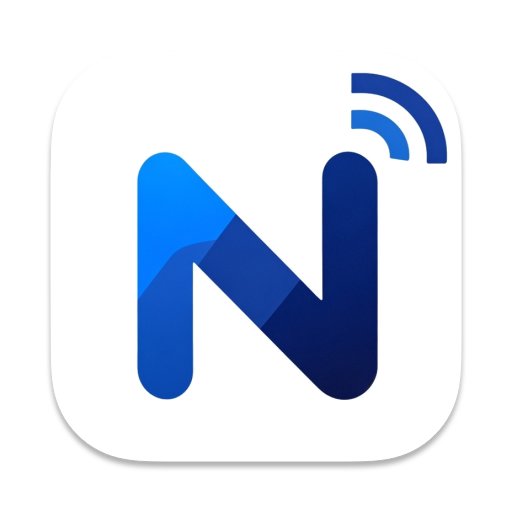
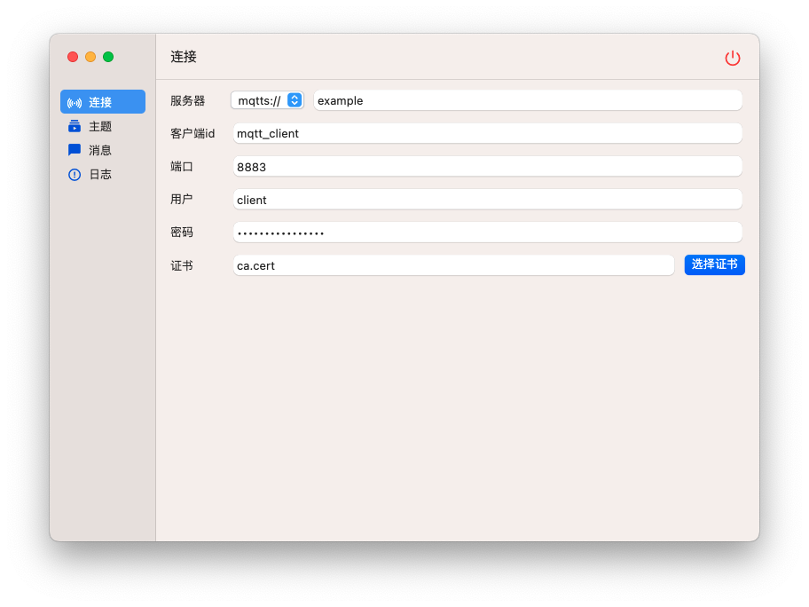
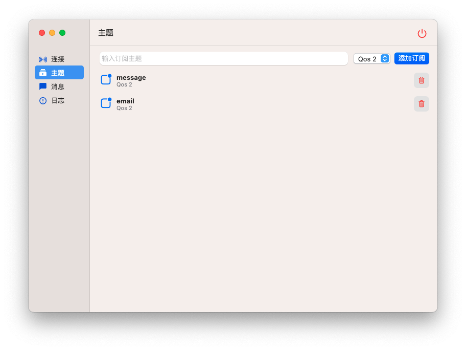
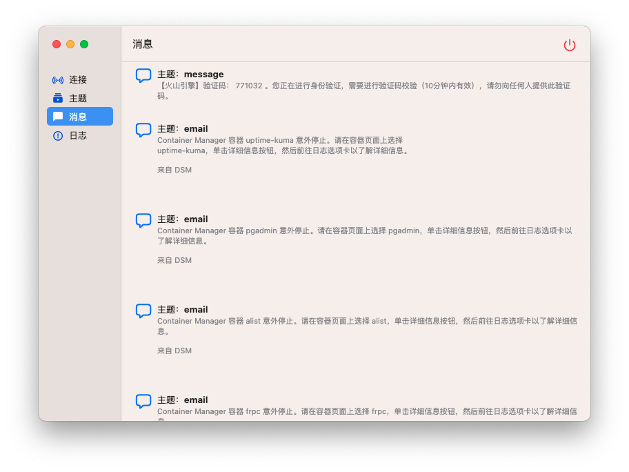
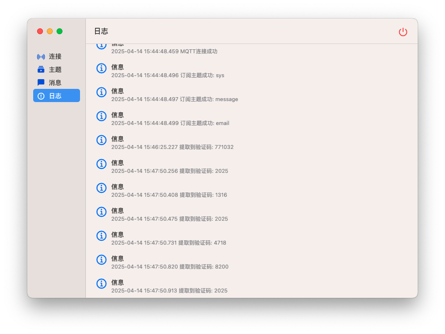
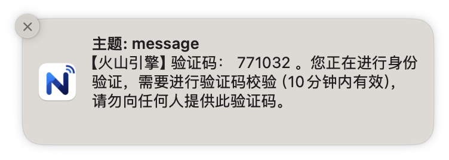

# MQTT 通知工具



一个Mac平台的MQTT客户端工具，支持订阅主题、接收消息和系统通知。
配合[SmsForwarder](https://github.com/pppscn/SmsForwarder)实现在电脑端方便使用短信验证码登陆

## 功能特性

- 连接MQTT服务器（仅支持mqtts://协议）
- 订阅/取消订阅主题（支持QoS 0/1/2级别）
- 接收消息并显示
- 系统托盘通知（支持显示/隐藏窗口）
- 支持SSL/TLS证书认证
- 主题订阅持久化存储

## 系统要求

- Flutter 3.0+
- Dart 2.17+

## 安装步骤

1. 确保已安装Flutter SDK
2. 克隆项目: `git clone https://github.com/your-repo/mqtt_notifier.git`
3. 进入项目目录: `cd mqtt_notifier`
4. 安装依赖: `flutter pub get`
5. 运行应用: `flutter run`

## 使用说明

1. **连接设置**
   
   - 在连接页面配置服务器地址（如mqtt://broker.example.com:1883）
   - 可选：上传SSL/TLS证书（支持.crt/.pem格式）

2. **主题管理**
   
   - 在主题页面添加订阅主题
   - 设置QoS级别（0/1/2）
   - 点击删除按钮取消订阅

3. **消息查看**
   
   - 在消息页面查看接收的消息
   - 消息按时间倒序排列

4. **系统托盘**
   
   - 右键点击托盘图标可显示/隐藏窗口
   - 支持退出应用

5. **系统通知**
   
   - 自动识别短信验证码，并复制到剪贴板

## 开发

```bash
# 运行开发版本
flutter run

# 生成发布版本
flutter build macos
```

## 贡献指南

欢迎提交Pull Request或报告问题。请确保：

- 代码符合Dart风格指南
- 包含适当的测试
- 更新相关文档

## 许可证

MIT License

## 相关项目

- [SmsForwarder](https://github.com/pppscn/SmsForwarder) - 一个短信转发工具

hdiutil create -fs HFS+ -srcfolder /Users/mac/FlutterProjects/mqtt_notifier/build/macos/Build/Products/Release/MqttNotifier.app -volname MqttNotifier /Users/mac/FlutterProjects/mqtt_notifier/build/macos/Build/Products/Release/MqttNotifier.dmg